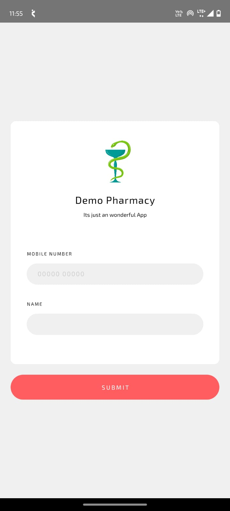
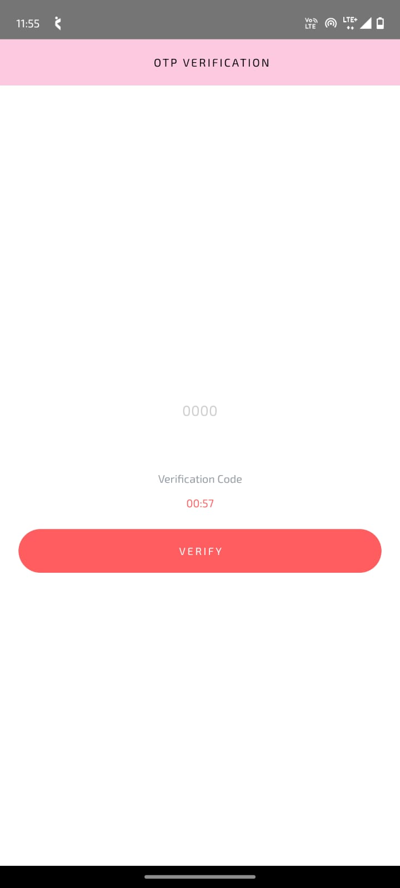
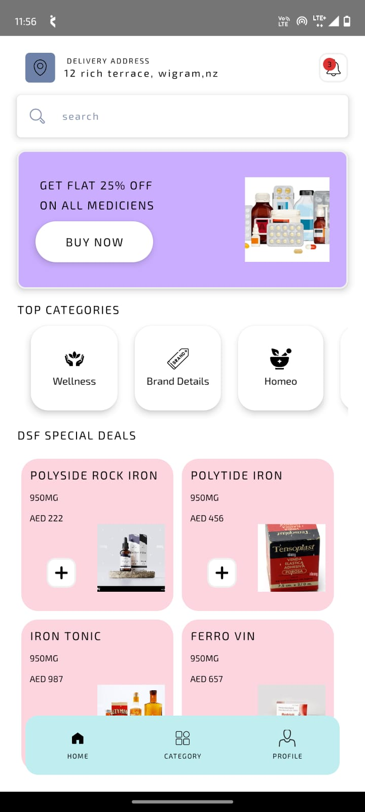
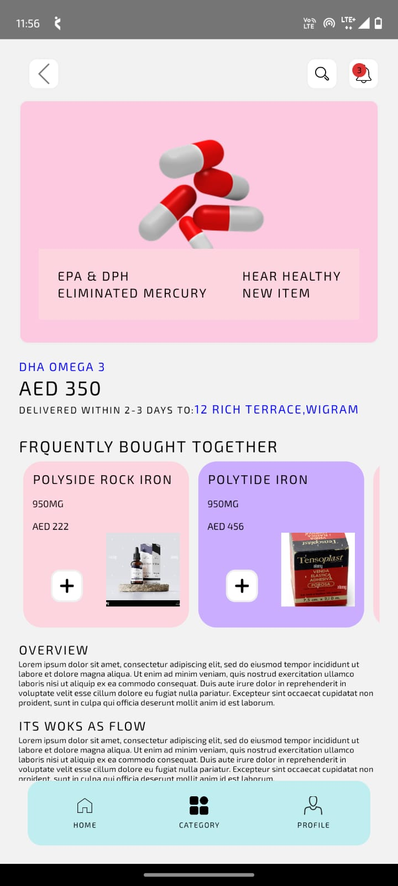
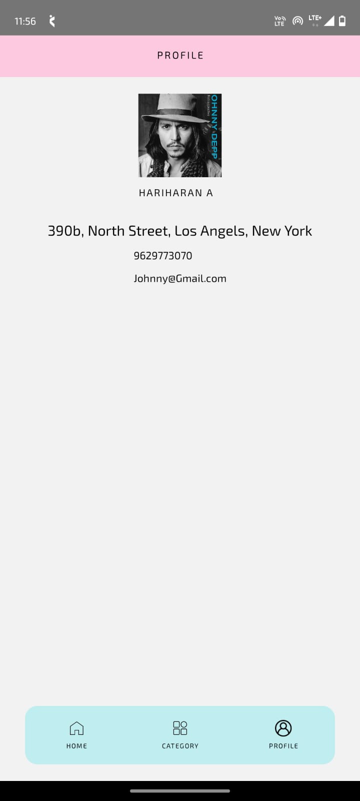
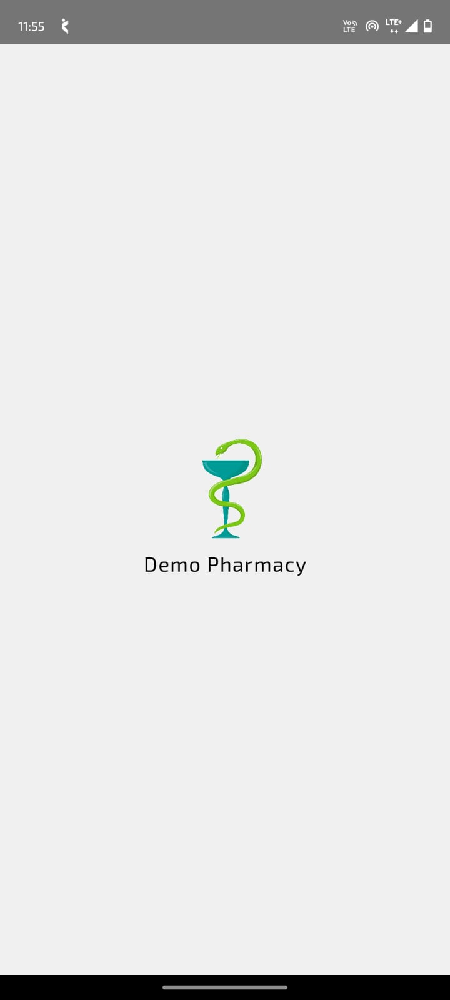

# 💊 PharmacyDemo

A clean and functional mobile app built using **React Native** for browsing and managing pharmacy products. This app features user authentication via OTP, category-based product listings, and profile management — all wrapped in a modern UI experience.

---

## 🚀 Features

- 🔐 Login with OTP
- 🏠 Home screen with product highlights
- 🗂️ Browse categories
- 👤 User profile screen
- 💡 Clean UI with responsive design

---

## 🧰 Tech Stack


---

### Folder Structure
src/
  ├── Assets/
  │   └── ScreenShots/
  ├── components/
  ├── screens/
  └── navigation/

  ----

## 🖼️ Screenshots

### 🔐 Login  


### 🔑 OTP  


### 🏠 Home  


### 🗂️ Category  


### 👤 Profile  


### 🧠 Logo  


---

## 📦 Installation & Running Locally

```bash
git clone https://github.com/Hariharan09/PharmacyDemo.git
cd PharmacyDemo
npm install

# For Android (React Native CLI)
npx react-native run-android

# Or if using Expo
npx expo start

  
